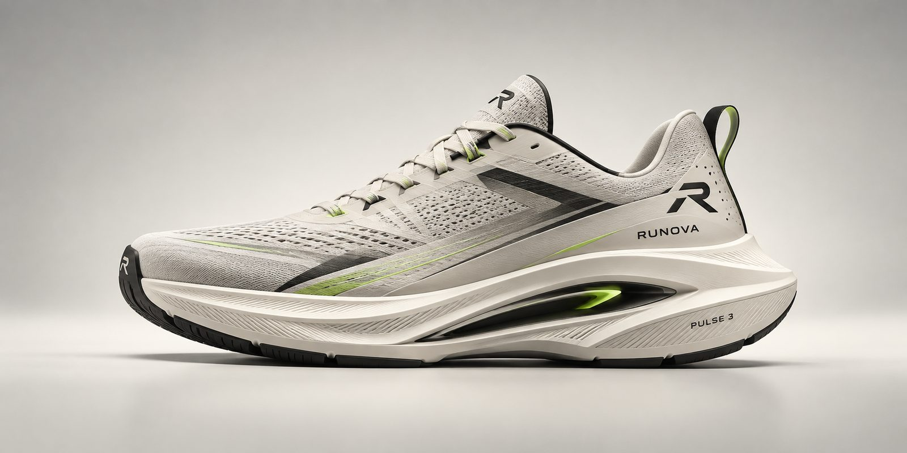

# OIBSIP-demo
# Runova — Shoe Brand Landing Page

A static, responsive landing page for **Runova**, a fictional running shoe brand. Built as a front-end fundamentals project — no frameworks, no build step, just semantic HTML5 and hand-written CSS3.

**Live site:** https://rushilk08.github.io/OIBSIP-demo

---

## Tech stack

- **HTML5** — semantic markup (`header`, `main`, `section`, `article`, `footer`, native `<details>/<summary>` for the FAQ accordion)
- **CSS3** — Flexbox + Grid for layout, CSS custom properties for theming and per-image sizing, no JavaScript anywhere
- **Fonts** — [Archivo](https://fonts.google.com/specimen/Archivo) (headings), [Inter](https://fonts.google.com/specimen/Inter) (body), [Space Mono](https://fonts.google.com/specimen/Space+Mono) (spec labels), loaded via Google Fonts

## Project structure

```
runova/
├── index.html
├── style.css
├── README.md
└── images/
    ├── pulse3-hero.jpg
    ├── pulse3-studio.jpg
    ├── drift-trail.jpg
    └── court-high.jpg
```

Keep this folder structure intact — `index.html` references the stylesheet and images by relative path (`style.css`, `images/*.jpg`). Moving files out of place, or renaming `style.css`, will break the page.

## Sections

| Section | What's in it |
|---|---|
| **Nav** | Sticky header, logo, 5 links (Collection, Technology, Compare, Stories, FAQ), CTA button |
| **Hero** | Headline, subheadline, CTA, hero photo, spec row (model / stack height / heel drop / weight / propulsion) |
| **Technology** | 4 material/tech cards on a dark background, each with a CSS-generated texture swatch |
| **Measured, not marketed** | Stat rows with large numbers and supporting copy |
| **Collection** | 3 product cards (Pulse 3, Drift Trail, Court High), each with a real photo, price (₹), description, and mini specs |
| **Stories** | 3 testimonial cards |
| **FAQ** | Native `<details>` accordion — no JS required |
| **Footer** | Nav columns, GitHub / LinkedIn / email links, copyright |

## Customization notes

**Colour palette** — all colours are defined once as CSS custom properties at the top of `style.css` (`:root`), so the whole site can be re-themed by editing that one block:

```css
--paper: #F3F2ED;   /* light background */
--ink:   #0E0E0C;   /* dark background / text */
--lime:  #C7FF3E;   /* accent */
```

**Image sizing** — each photo frame has its own size controls set inline in `index.html`, so you can resize or recrop any single image without touching the CSS file:

```html
<div class="frame frame-photo" style="--frame-h:220px; --frame-pos:center 42%;">
  
</div>
```

- `--frame-h` — frame height (e.g. `260px`)
- `--frame-pos` — crop position (`object-position`), e.g. `center 55%` shows more of the lower half of the photo
- `--frame-fit` *(optional)* — set to `contain` to show the whole photo instead of cropping (default is `cover`)

The hero photo works the same way, with `--hero-h`, `--hero-h-mobile`, and `--hero-pos` set inline on `.hero-visual`.

**Scroll offsets** — each section has its own `scroll-margin-top` in `style.css` (rather than one shared value), so the sticky nav clears each heading correctly when jumped to from a nav link. If a section's content ever appears to start too close to (or too far from) the nav after an edit, its offset is set individually under `#lineup`, `#tech`, `#measured`, `#stories`, and `#faq` — with separate, tighter values again inside the `@media (max-width: 720px)` block for mobile.

## Responsive breakpoints

- **≤ 980px** — grids collapse from 3–4 columns down to 2
- **≤ 720px** — nav links hide (logo + CTA remain), grids collapse to 1 column, hero and section padding tighten for smaller screens

## Known issues

A couple of things worth a look next time you're in `style.css`:

- Inside the `@media (max-width: 720px)` block, there's a second `@media (max-width: 720px)` nested directly inside it (around the `.shoe-card .frame` height rule). Most modern browsers now support native CSS nesting and will render it fine, but it's non-standard and worth flattening into the outer block for safety on older browsers.
- `.hero{ padding: 56px 4px 0; }` on mobile leaves only 4px of horizontal padding, and `.hero .btn-solid{ transform: translateX(-13px); }` nudges the CTA button left — double-check these look intentional on an actual phone, as they read like leftover fine-tuning.

## Running locally

No build step — just open `index.html` in a browser, or serve the folder with any static server, e.g.:

```bash
npx serve .
```

## Credits

Product photography generated for this project. Social/contact links in the footer point to placeholder GitHub/LinkedIn accounts and a placeholder email — update them to your real accounts before sharing publicly.